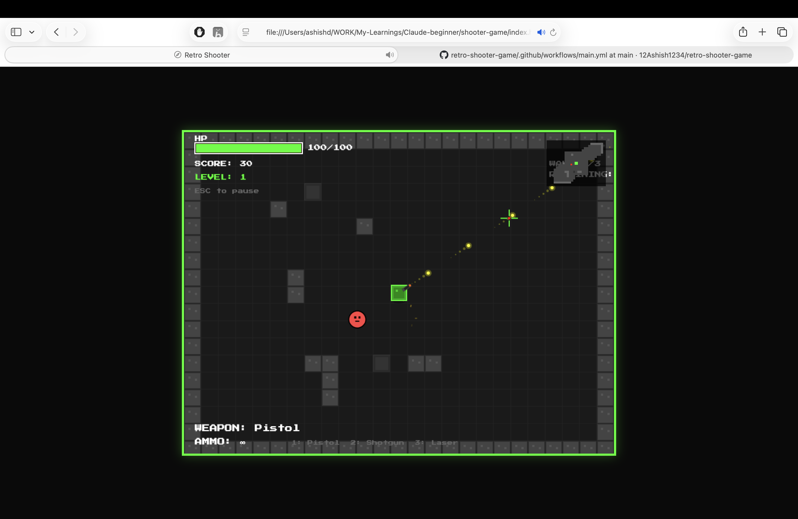

# Retro Shooter

A top-down, retro-style top-down shooter built with vanilla JavaScript and HTML5 Canvas. Survive 15 levels of increasing difficulty, battle elite enemies, and conquer three unique bosses across different environments.

## 🎮 How to Play

### Controls
- **Movement:** `WASD` or `Arrow Keys`
- **Aim:** `Mouse Movement`
- **Shoot:** `Left Mouse Click`
- **Weapon Selection:** 
  - `1`: Pistol (Unlimited Ammo)
  - `2`: Shotgun (Limited Ammo)
  - `3`: Laser (Limited Ammo)
- **Pause:** `ESC`

### Objectives
- Survive 3 waves per level to progress.
- Every 5th level features a powerful Boss enemy.
- Collect powerups dropped by enemies to boost your stats.
- Chain kills quickly to increase your Combo Multiplier and boost your score.

## 🚀 How to Run

1.  Clone or download this repository.
2.  Open the `shooter-game/index.html` file in any modern web browser.
3.  Click **START GAME** and enjoy!

## 🛠️ Technical Features (For Developers)

This project is a demonstration of pure vanilla JavaScript game development without external libraries or frameworks.

### Core Architecture
- **State-Driven Game Loop:** Uses `requestAnimationFrame` for smooth 60FPS updates and rendering.
- **Modular Class Structure:** Logic is separated into distinct modules (`player.js`, `enemy.js`, `tilemap.js`, etc.) for maintainability.

### Systems
- **Procedural Tile Map Generation:** 
  - Supports three distinct themes: **Facility** (corridors), **Cave** (organic cellular automata), and **Arena** (open tactical).
  - Includes terrain types with physics effects: Water (slows movement) and Lava (damages over time).
- **Advanced Entity System:**
  - AI movement using vector math to track and chase the player.
  - Multi-tier enemy hierarchy: Basic, Fast, Tank, Elite (buffed stats), and Boss (unique patterns/health bars).
- **Weapon & Ammo System:**
  - Multiple weapon profiles with unique fire rates, spread, damage, and recoil.
  - Limited ammo management for high-tier weapons.
- **Powerup Manager:**
  - Chance-based drops on enemy death.
  - Features: Rapid Fire, Damage Boost, Speed Boost, Multi-Shot, Shield, and Health Packs.
  - Dynamic magnet physics: Powerups are pulled toward the player when in proximity.
- **Synthesized Audio:**
  - Real-time sound synthesis using the **Web Audio API** (Oscillators, Gain nodes, and Biquad filters). No external audio files required.
- **Custom Particle System:**
  - Optimized system for muzzle flashes, blood splatters, shell casings, footstep dust, and explosions.
  - Support for persistent blood splatter rendered to a background buffer canvas for performance.
- **Minimap & HUD:**
  - Real-time minimap rendering.
  - Dynamic HUD showing health, score, level progress, active powerup timers, and ammo counts.
- **Collision Detection:**
  - Circle-to-circle and Circle-to-Rectangle collision logic for entities and projectiles.
  - Integrated Tile-based wall collision with sliding physics.

---
Built as a coding exercise to explore low-level game mechanics in the browser.
